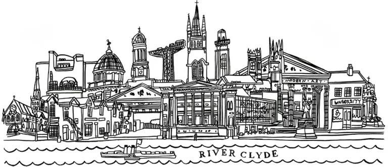

# Project 3: An investigation into the split of property ownership in Glasgow, Scotland

# Project objective:  
This project aims to showcase the skills we have learned in the University of Birmingham's Data Analytics Bootcamp.  

### Overview

# Dataset  

We obtained our dataset from Kaggle and it provides a complete overview of the properties in Glasgow ownership split  
between the Housing Association and others. While this dataset contained a "cleaned" version of the data, we decided  
to use to base dataset and demonstrate our data-cleaning skills. A link to the dataset can be found [here](https://www.kaggle.com/datasets/dimodimchev/glasgow-housing-association-properties) and also in
the resources folder. A limitation of this dataset is that the data was

### Methodology  

After selecting our Kaggle dataset 

###Resources

### Collaborators

* [Sadek Ahmed](https://github.com/Sadek-Ahmed16)  
* [Daniel Hughes](https://github.com/DanielHughes1580)  
* [Eoghan Alton](https://github.com/ERAA1997)
* [Kashfi Khalid](https://github.com/kashfi-khalid)
