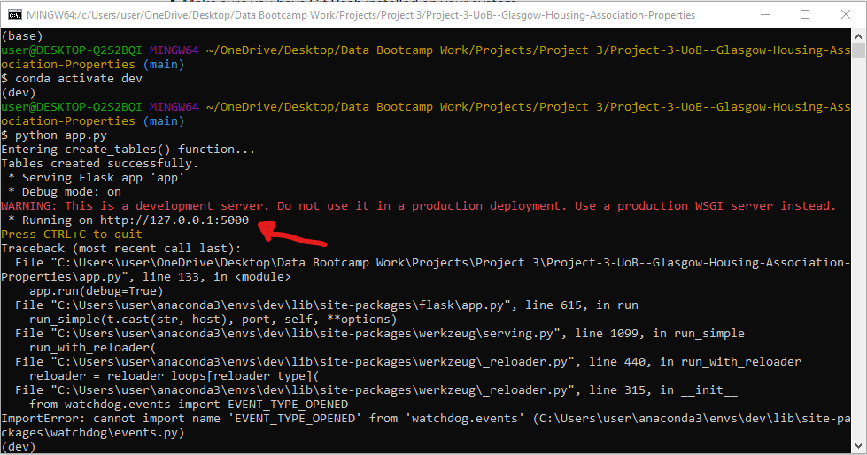
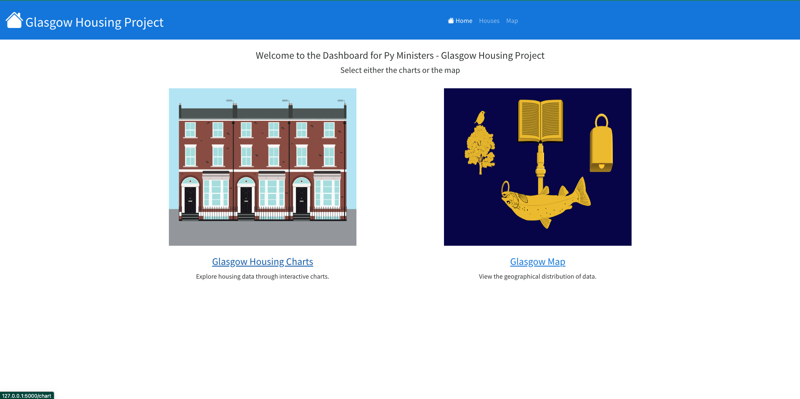
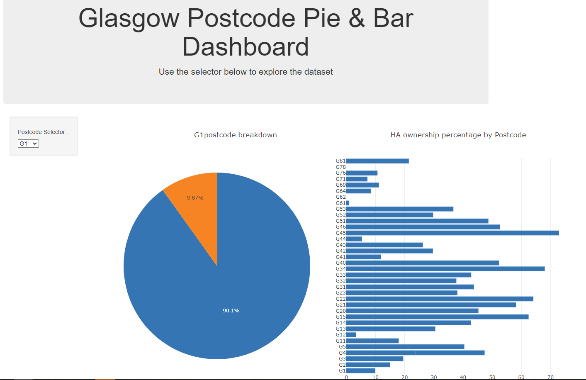
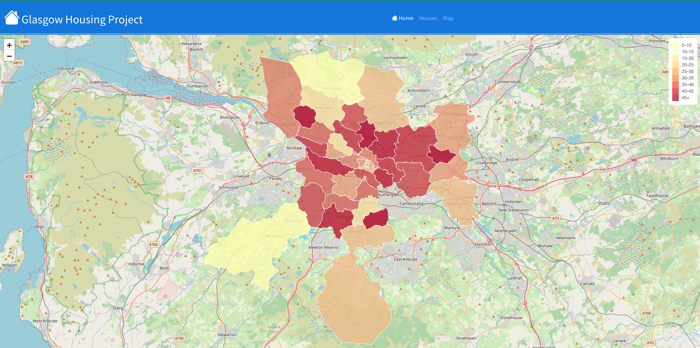

# Project 3: An investigation into the split of property ownership in Glasgow, Scotland

#### image credit: [Adrian McMurchie](https://amcmurchie.com/product/glasgow-skyline-monochrome/)

# Project Objective:  
This project aims to showcase the skills we have learned in the University of Birmingham's Data Analytics Bootcamp
to date. 

# Overview

## Purpose
The purpose of this project was to analysis how much propertyof the housing property is owned by the housing association in the city of Glasgow. Below you will find our process on how we went about this task and the steps we have taken 

## Dataset  

We obtained our dataset from Kaggle and it provides a complete overview of the properties within Glasgow's postcodes
by ownership, split between the Housing Association and others. While this dataset contained a "cleaned" version of the data, 
we decided to use the base dataset and demonstrate our data-cleaning skills. A link to the dataset can be found [here](https://www.kaggle.com/datasets/dimodimchev/glasgow-housing-association-properties) and also in
the resources folder. A limitation of this dataset is that the data was that it was last updated in May 2022.

## Methodology  

### Data Review and Cleaning

After selecting our Kaggle dataset we used a Jupyter Notebook and Pandas. Using Pandas we could quickly and easily identify the
completeness of data. The dataset was read into Pandas using the _read_csv_ function. The cleaned data was then exported as a new CSV 
to be used later.

In addition to the Kaggle dataset, we required a geoJSON file of the Glasgow postcodes to help us later plot our choropleth map. 

The previously cleaned CSV of our Kaggle dataset was then merged with the geoJSON to create an update geoJSON with the additional data being
callable within it

### Ethical Implications of our Data
As our project involved us handling sensitive data such as postcodes, geographical coordinates, and other sensitive locational data, prioritizing our ethical responsibilities became the most important thing we had to take into account throughout this project. We had an ethical responsibility to make sure that the sensitive, personal information we were given was handled correctly, filtering out any and all personal details. Ensuring that we followed any and all relevant legal and ethical restrictions pertaining to us was always a top priority when dealing with such a sensitive dataset as this.

### Connecting to a Database

As a final addition to our project, we used Flask to connect our SQLite database. This would further  help allow us to manipulate the data to suit our needs in the future

## Visualisations

There are a few ways in which we decided to visualise our data. As we were dealing with a locational data set a choropleth map seemed a great way to visualize our findings. Our choropleth shows the differences in Housing Association ownership compared to non housing association ownership in an interactive and visually appealing way. Another way we had decided to display our information is in the form of an interactive pie chart; displaying a breakdown of any postcode chosen from our interactive drop down box.

## Utilizing our Project

### Initalising 
To initalise our project first you will need to run the "app.py" programe in a fresh terminal. Once initalised you will be given a web address like the one we have highlighted, paste this into a fresh tab in a browser to begin.

### Dashboard
Once in you will be presented with our dashboard. From here you can click either of the below images to be taken to the diferent sections of our page. The picture on the left will take you to our interactive charts. The picture on the right will take you to our interactive choropleth map.

### Interactive Charts
If you clicked on the interactive charts section this is the screen you will be presented with. As you can see you will be presented with two different charts. The first being our interactive pie charts. From here simply select the post code you wish to view the data for and the pie chart will update for you to display the relevant data! To the right you will find our static bar chart. This feature displays all the postcodes Housing Association ownership percentages in an easy to read bar chart! 

### Choropleth
If you clicked on the choropleth section this is the screen you will be presented with. You will be presented with a choropleth map of Glasgow with with pop ups that display any relevant information to the area you have selected!

### Resources
For this project we utilized many sources, please find them below;

[SQL](https://www.sqlite.org/index.html)  
[Flask API](https://flask.palletsprojects.com/en/3.0.x/)  
[Chloropleth](https://plotly.com/python/choropleth-maps/)  
[Leaflet](https://leafletjs.com/reference.html)  
[D3](https://d3js.org/) 

## Collaborators

* [Sadek Ahmed](https://github.com/Sadek-Ahmed16)  
* [Daniel Hughes](https://github.com/DanielHughes1580)  
* [Eoghan Alton](https://github.com/ERAA1997)
* [Kashfi Khalid](https://github.com/kashfi-khalid)
